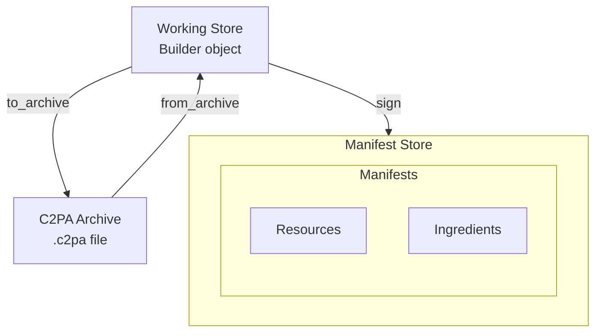
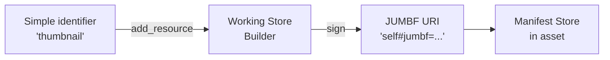

# Manifests, working stores, and archives

This table summarizes the fundamental entities that you work with when using the CAI SDK.

| Object | Description | Where it is | Primary API |
|--------|-------------|-------------|-------------|
| [**Manifest store**](#manifest-store) | Final signed provenance data. Contains one or more manifests. | Embedded in asset or remotely in cloud | [`Reader`](https://contentauth.github.io/c2pa-cpp/d9/dbb/classc2pa_1_1Reader.html) class |
| [**Working store**](#working-store) | Editable in-progress manifest. | `Builder` object | [`Builder`](https://contentauth.github.io/c2pa-cpp/da/db7/classc2pa_1_1Builder.html) class |
| [**Archive**](#archive) | Serialized working store | `.c2pa` file/stream | [`Builder::to_archive()`](https://contentauth.github.io/c2pa-cpp/da/db7/classc2pa_1_1Builder.html#a68074eac71b7fc57d338019220101db3)<br/> [`Builder::from_archive()`](https://contentauth.github.io/c2pa-cpp/da/db7/classc2pa_1_1Builder.html#a913c64f6b5ec978322ef0edc89e407b3) |
| [**Resources**](#working-with-resources) | Binary assets referenced by manifest assertions, such as thumbnails or ingredient thumbnails. | In manifest. | [`Builder::add_resource()`](https://contentauth.github.io/c2pa-cpp/da/db7/classc2pa_1_1Builder.html#a45bf6fc8163b0194b334aa21f73f8476) <br/> [`Reader::get_resource`](https://contentauth.github.io/c2pa-cpp/d9/dbb/classc2pa_1_1Reader.html#a308939c990cab98bf8435c699bc96096) |
| [**Ingredients**](#working-with-ingredients) | Source materials used to create an asset. | In manifest. | [`builder.add_ingredient`](https://contentauth.github.io/c2pa-cpp/da/db7/classc2pa_1_1Builder.html#a49407f9604a53b5b68bcfa699cba05f5)

This diagram summarizes the relationships among these entities.



## Key entities

### Manifest store

A _manifest store_ is the data structure that's embedded in (or attached to) a signed asset. It contains one or more manifests that contain provenance data and cryptographic signatures.

**Characteristics:**

- Final, immutable signed data embedded in or attached to an asset.
- Contains one or more manifests (identified by URIs).
- Has exactly one `active_manifest` property pointing to the most recent manifest.
- Read it by using a `Reader` object.

**Example:** When you open a signed JPEG file, the C2PA data embedded in it is the manifest store.

For more information, see:
- [Reading manifest stores from assets](#reading-manifest-stores-from-assets)
- [Creating and signing manifests](#creating-and-signing-manifests)
- [Embedded vs external manifests](#embedded-vs-external-manifests)

### Working store

A _working store_ is a `Builder` object representing an editable, in-progress manifest that has not yet been signed and bound to an asset. Think of it as a manifest in progress, or a manifest being built.

**Characteristics:**

- Editable, mutable state in memory (a Builder object).
- Contains claims, ingredients, and assertions that can be modified.
- Can be saved to a C2PA archive (`.c2pa` JUMBF binary format) for later use.

**Example:** When you create a `Builder` object and add assertions to it, you're dealing with a working store, as it is an "in progress" manifest being built.

For more information, see [Using Working stores](#using-working-stores).

### Archive

A _C2PA archive_ (or just _archive_) contains the serialized bytes of a working store saved to a file or stream (typically a `.c2pa` file). It uses the standard JUMBF `application/c2pa` format.

**Characteristics:**

- Portable serialization of a working store (Builder).
- Save an archive by using [`Builder::to_archive()`](https://contentauth.github.io/c2pa-cpp/da/db7/classc2pa_1_1Builder.html#a68074eac71b7fc57d338019220101db3) and restore a full working store from an archive by using [`Builder::from_archive()`](https://contentauth.github.io/c2pa-cpp/da/db7/classc2pa_1_1Builder.html#a913c64f6b5ec978322ef0edc89e407b3).
- Useful for separating manifest preparation ("work in progress") from final signing.

For more information, see [Working with archives](#working-with-archives)

## Reading manifest stores from assets

Use the `Reader` class to read manifest stores from signed assets.

### Reading from a file

```cpp
#include <c2pa.hpp>
#include <iostream>
#include <nlohmann/json.hpp>

int main() {
    try {
        c2pa::Context context;
        // Create a Reader from a signed asset file
        auto reader = c2pa::Reader(context, "signed_image.jpg");

        // Get the manifest store as JSON
        std::string manifest_store_json = reader.json();
    } catch (const c2pa::C2paException& e) {
        std::cerr << "C2PA Error: " << e.what() << std::endl;
    }
}
```

### Reading from a stream

```cpp
#include <fstream>

c2pa::Context context;
std::ifstream file_stream("signed_image.jpg", std::ios::binary);
if (file_stream.is_open()) {
    auto reader = c2pa::Reader(context, "image/jpeg", file_stream);
    std::string manifest_json = reader.json();
    file_stream.close();
}
```

### Using Context for configuration

For more control over validation and trust settings, use a `Context`:

```cpp
// Create context with custom validation settings
c2pa::Context context(R"({
  "verify": {
    "verify_after_sign": true
  }
})");

// Use context when creating Reader
auto reader = c2pa::Reader(context, "signed_image.jpg");
std::string manifest_json = reader.json();
```

### Checking if the manifest store is embedded

```cpp
auto reader = c2pa::Reader("signed_image.jpg");

if (reader.is_embedded()) {
    std::cout << "Manifest store is embedded in the asset" << std::endl;
} else {
    std::cout << "Manifest store is external" << std::endl;

    // Get remote URL if available
    auto remote_url = reader.remote_url();
    if (remote_url.has_value()) {
        std::cout << "Remote URL: " << remote_url.value() << std::endl;
    }
}
```

## Using working stores

A **working store** is represented by a `Builder` object. It contains "live" manifest data as you add information to it.

### Creating a working store

```cpp
// Create an empty working store
c2pa::Context context;
auto builder = c2pa::Builder(context);

// Create a working store with a manifest definition
const std::string manifest_json = R"({
  "claim_generator_info": [{
    "name": "example-app",
    "version": "0.1.0"
  }],
  "title": "Example asset",
  "assertions": [ ... ]
})";

auto builder = c2pa::Builder(context, manifest_json);
```

### Modifying a working store

Before signing, you can modify the working store (Builder):

```cpp
// Update or replace the manifest definition
builder.with_definition(updated_manifest_json);

// Add binary resources (like thumbnails)
builder.add_resource("thumbnail", "thumbnail.jpg");

// Add ingredients (source files)
builder.add_ingredient(ingredient_json, "source.jpg");

// Add actions
const std::string action_json = R"({
  "action": "c2pa.created",
  "digitalSourceType": "http://cv.iptc.org/newscodes/digitalsourcetype/<<pick a type>>"
})";
builder.add_action(action_json);

// Configure embedding behavior
builder.set_no_embed();  // Don't embed manifest in asset
builder.set_remote_url("<<Example remote URL>>");
```

### From working store to manifest store

When you sign an asset, the working store (Builder) becomes a manifest store embedded in the output:

```cpp
// Create a signer
auto signer = c2pa::Signer("Es256", certs, private_key, tsa_url);

// Sign the asset - working store becomes a manifest store
// The manifest store is embedded in the output asset
auto manifest_bytes = builder.sign("source.jpg", "signed.jpg", signer);

// Now "signed.jpg" contains a manifest store
// You can read it back with Reader
auto reader = c2pa::Reader("signed.jpg");
std::string manifest_store_json = reader.json();  // This is the manifest store
```

## Creating and signing manifests

### Creating a Builder (working store)

```cpp
// Create with default settings
c2pa::Context context;
auto builder = c2pa::Builder(context, manifest_json);

// Or with custom settings
c2pa::Context custom_context(R"({
  "builder": {
    "thumbnail": {
      "enabled": true
    }
  }
})");
auto builder = c2pa::Builder(custom_context, manifest_json);
```

### Creating a Signer

For testing, create a [`Signer`](https://contentauth.github.io/c2pa-cpp/d3/da1/classc2pa_1_1Signer.html) with certificates and private key:

```cpp
#include <fstream>
#include <sstream>

std::string read_file(const std::filesystem::path& path) {
    std::ifstream file(path);
    std::stringstream buffer;
    buffer << file.rdbuf();
    return buffer.str();
}

// Load credentials
std::string certs = read_file("certs.pem");
std::string private_key = read_file("private_key.pem");

// Create signer
auto signer = c2pa::Signer(
    "Es256",                              // Algorithm: Es256, Es384, Es512, Ps256, Ps384, Ps512, Ed25519
    certs,                                // Certificate chain in PEM format
    private_key,                          // Private key in PEM format
    "http://timestamp.digicert.com"       // Optional timestamp authority URL
);
```

> [!WARNING]
> Never hard-code or directly access private keys in production. Instead use a Hardware Security Module (HSM) or Key Management Service (KMS).

Supported algorithms: Es256, Es384, Es512, Ps256, Ps384, Ps512, Ed25519. See [X.509 certificate documentation](https://opensource.contentauthenticity.org/docs/c2patool/x_509) for details.

### Signing an asset

```cpp
try {
    // Sign: The manifest store will be embedded in the signed asset
    builder.sign(
        "source_image.jpg",    // Source asset
        "signed_image.jpg",    // Output asset with embedded manifest store
        signer                 // Signer instance
    );

    std::cout << "Signed successfully!" << std::endl;

} catch (const c2pa::C2paException& e) {
    std::cerr << "Signing failed: " << e.what() << std::endl;
}
```

### Signing with streams (recommended)

The stream API is recommended as it provides better control and memory efficiency:

```cpp
#include <fstream>

std::ifstream source("source.jpg", std::ios::binary);
std::fstream output("signed.jpg",
                    std::ios::binary | std::ios::in | std::ios::out | std::ios::trunc);

if (source.is_open() && output.is_open()) {
    // The manifest store will be embedded in the signed asset
    builder.sign(
        "image/jpeg",    // MIME type
        source,          // Input stream
        output,          // I/O stream (must support read, write, and seek)
        signer
    );

    source.close();
    output.close();
}
```

### Complete example

This code combines the above examples to create, sign, and read a manifest.

```cpp
#include <c2pa.hpp>
#include <nlohmann/json.hpp>
#include <iostream>

using json = nlohmann::json;

int main() {
    try {
        // 1. Define manifest for working store
        const std::string manifest_json = R"({
          "claim_generator_info": [{"name": "demo-app", "version": "0.1.0"}],
          "title": "Signed image",
          "assertions": [
            ...
          ]
        })";

        // 2. Load credentials
        std::string certs = read_file("certs.pem");
        std::string private_key = read_file("private_key.pem");

        // 3. Create signer
        auto signer = c2pa::Signer("Es256", certs, private_key,
                                   "http://timestamp.digicert.com");

        // 4. Create working store (Builder) and sign
        c2pa::Context context;
        auto builder = c2pa::Builder(context, manifest_json);
        builder.sign("source.jpg", "signed.jpg", signer);

        std::cout << "Asset signed - working store is now a manifest store" << std::endl;

        // 5. Read back the manifest store
        auto reader = c2pa::Reader("signed.jpg");
    } catch (const c2pa::C2paException& e) {
        std::cerr << "Error: " << e.what() << std::endl;
        return 1;
    }

    return 0;
}
```

## Working with resources

_Resources_ are binary assets referenced by manifest assertions, such as thumbnails or ingredient thumbnails.

### Understanding resource identifiers

When you add a resource to a working store (Builder), you assign it an identifier string. When the manifest store is created during signing, the SDK automatically converts this to a proper JUMBF URI.

**Resource identifier workflow:**



1. **During manifest creation**: You use a string identifier (e.g., `"thumbnail"`, `"thumbnail1"`).
2. **During signing**: The SDK converts these to JUMBF URIs (e.g., `"self#jumbf=c2pa.assertions/c2pa.thumbnail.claim.jpeg"`).
3. **After signing**: The manifest store contains the full JUMBF URI that you use to extract the resource.

### Extracting resources from a manifest store

To extract a resource, you need its JUMBF URI from the manifest store:

```cpp
// Pre-requisite: Having a JSON-parsing library to parse the Reader's JSON easily

auto reader = c2pa::Reader("signed_image.jpg");
json manifest_store = json::parse(reader.json());

// Get active manifest
std::string active_uri = manifest_store["active_manifest"];
json& manifest = manifest_store["manifests"][active_uri];

// Extract thumbnail if it exists
if (manifest.contains("thumbnail")) {
    // The identifier is the JUMBF URI
    std::string thumbnail_uri = manifest["thumbnail"]["identifier"];
    // Example: "self#jumbf=c2pa.assertions/c2pa.thumbnail.claim.jpeg"

    // Extract to file using the JUMBF URI
    int64_t bytes = reader.get_resource(thumbnail_uri, "thumbnail.jpg");
    std::cout << "Extracted " << bytes << " bytes to thumbnail.jpg" << std::endl;
}
```

### Extracting to a stream

```cpp
std::ofstream output("thumbnail.jpg", std::ios::binary);
if (output.is_open()) {
    int64_t bytes = reader.get_resource(thumbnail_uri, output);
    output.close();
}
```

### Adding resources to a working store

When building a manifest, you add resources using identifiers. The SDK will reference these in your manifest JSON and convert them to JUMBF URIs during signing.

**Pattern:**

```cpp
c2pa::Context context;
auto builder = c2pa::Builder(context, manifest_json);

// Add resource with a simple identifier
// The identifier must match what you reference in your manifest JSON
builder.add_resource("thumbnail", "path/to/thumbnail.jpg");

// Or add from stream
std::ifstream resource_stream("thumbnail.jpg", std::ios::binary);
builder.add_resource("thumbnail", resource_stream);
resource_stream.close();

// Sign: the "thumbnail" identifier becomes a JUMBF URI in the manifest store
builder.sign("source.jpg", "signed.jpg", signer);
```

## Working with ingredients

Ingredients represent source materials used to create an asset, preserving the provenance chain. Ingredients themselves can be turned into ingredient archives (`.c2pa`).

### Ingredient vs. ingredient archive

A **(plain) ingredient** is a source asset that the builder reads at `add_ingredient` time. The builder sees the asset's bytes, and stores live required ingredient data (including any caller-set `instance_id`) inside the new manifest.

An **ingredient archive** (in c2pa-archive-format) is a `.c2pa` file that already contains a fully-formed ingredient. It can be produced with `write_ingredient_archive` (dedicated ingredient archive APIs) or with `to_archive()` on a builder holding one ingredient (legacy). When passed to `add_ingredient`, the builder treats the archive's contents as opaque provenance: the archive's internal fields are not exposed as live JSON the signing builder can introspect (or use for linking to actions). Only the JSON the caller supplies in the current `add_ingredient` call is visible to the builder in that round.

For the dedicated ingredient archive APIs, see [Single-ingredient archive APIs](#single-ingredient-archive-apis).

This difference governs how each can be linked to an action via `ingredientIds`. The table below describes the **legacy** load path for ingredient archives, where the archive is passed directly to `add_ingredient` with format `"application/c2pa"`:

| Aspect | Ingredient | Ingredient archive (legacy load via `add_ingredient(json, "application/c2pa", archive)`) |
| --- | --- | --- |
| Source format passed to `add_ingredient` | Asset MIME type (`image/jpeg`, `video/mp4`, ...) or asset path | `application/c2pa` or path to a `.c2pa` ingredient archive file |
| What it is | "Live" asset | A serialized manifest store (opaque provenance) |
| Linking via `label` | Primary linking key, set on the signing builder's `add_ingredient` JSON parameter | Only linking key that works, set on the signing builder's `add_ingredient` JSON |
| Linking via `instance_id` | Alternative to using `label` | Does not link, signing-time error |
| Linking via a `label` baked in at archive-creation time | N/A (not an archive) | Does not carry through, must be re-asserted on the signing builder, set on the signing builder's `add_ingredient` JSON parameter |

For the dedicated `write_ingredient_archive` + `add_ingredient_from_archive` ingredient archive APIs, linking rules differ: the archive key (either `label` or `instance_id`) flows through and becomes the `ingredientIds` value. See [Lookup keys and action linking](#lookup-keys-and-action-linking).

### Adding ingredients to a working store

When creating a manifest, add ingredients to preserve the provenance chain:

```cpp
c2pa::Context context;
auto builder = c2pa::Builder(context, manifest_json);

// Define ingredient metadata
const std::string ingredient_json = R"({
  "title": "Original asset",
  "relationship": "parentOf"
})";

// Add ingredient from file
builder.add_ingredient(ingredient_json, "source.jpg");

// Or add from stream with MIME type
std::ifstream ingredient_stream("source.jpg", std::ios::binary);
builder.add_ingredient(ingredient_json, "image/jpeg", ingredient_stream);
ingredient_stream.close();

// An ingredient can also be added from an ingredient archive,
// for instance if the original file is not available anymore, but you
// have an archived ingredient (1 ingredient per archive) at hand.
// The JSON parameter would then override what was in the archive and would be used for
// The ingredient added to the working store.
// builder.add_ingredient(ingredient_json, "application/c2pa", ingredient archive);

// Sign: ingredients become part of the manifest store
builder.sign("new_asset.jpg", "signed_asset.jpg", signer);
```

### Linking an ingredient archive to an action

This section covers the **legacy** load path: producer calls `to_archive`, signing builder calls `add_ingredient(json, "application/c2pa", archive)`. For the dedicated `write_ingredient_archive` + `add_ingredient_from_archive` ingredient archive APIs, see [Lookup keys and action linking](#lookup-keys-and-action-linking).

> [!IMPORTANT]
> **For the legacy load path, linking an ingredient archive is `label`-driven only.**
>
> - `instance_id` does not work as a linking key for ingredient archives loaded via `add_ingredient(json, "application/c2pa", archive)`. Use `label` instead.
> - Labels baked into the archive at archive-creation time do not carry through. The label must be re-asserted in the signing builder's `add_ingredient` JSON.
> - Both rules apply whether the archive is added by file path or by stream.
>
> Attempting to link via `instance_id`, or relying on a baked-in label alone, produces a sign-time error: `Action ingredientId not found: <id>`. See [Troubleshooting linking errors](#troubleshooting-linking-errors).

To link an ingredient archive to an action via `ingredientIds`, set a `label` on the JSON passed to `add_ingredient` on the signing builder, and use the same string in the action's `ingredientIds` array. A label, as linking key, links ingredients and actions using it together: the label identifies the link. Labels are build-time linking keys only. The SDK may reassign the actual label in the signed manifest during signing.


```cpp
c2pa::Context context;

// Step 1: Create the ingredient archive.
auto manifest_str = read_file("training.json");
auto archive_builder = c2pa::Builder(context, manifest_str);
archive_builder.add_ingredient(
    R"({"title": "photo.jpg", "relationship": "componentOf"})",
    "photo.jpg");
archive_builder.to_archive("ingredient.c2pa");

// Step 2: Build a manifest with an action that references the ingredient.
auto manifest_json = R"({
    "claim_generator_info": [{"name": "an-application", "version": "0.1.0"}],
    "assertions": [{
        "label": "c2pa.actions.v2",
        "data": {
            "actions": [{
                "action": "c2pa.placed",
                "parameters": {
                    "ingredientIds": ["my-ingredient"]
                }
            }]
        }
    }]
})";

auto builder = c2pa::Builder(context, manifest_json);

// Step 3: Add the ingredient archive with a label matching the ingredientIds value.
// The label MUST be set here, on the signing builder's add_ingredient call.
builder.add_ingredient(
    R"({"title": "photo.jpg", "relationship": "componentOf", "label": "my-ingredient"})",
    "ingredient.c2pa");

builder.sign("source.jpg", "signed.jpg", signer);
```

The stream overload of `add_ingredient` (with `"application/c2pa"` as the format) accepts the same `label`-based linking: open the archive as a `std::ifstream` and pass it instead of the file path:

```cpp
std::ifstream archive_stream("ingredient.c2pa", std::ios::binary);
builder.add_ingredient(
    R"({"title": "photo.jpg", "relationship": "componentOf", "label": "my-ingredient"})",
    "application/c2pa",
    archive_stream);
archive_stream.close();

builder.sign("source.jpg", "signed.jpg", signer);
```

When linking multiple ingredient archives, give each a distinct label and reference it in the appropriate action's `ingredientIds` array.

If each ingredient has its own action (e.g., one `c2pa.opened` for the parent and one `c2pa.placed` for a composited element), set up two actions with separate `ingredientIds`:

```cpp
auto manifest_json = R"({
    "claim_generator_info": [{"name": "an-application", "version": "0.1.0"}],
    "assertions": [{
        "label": "c2pa.actions.v2",
        "data": {
            "actions": [
                {
                    "action": "c2pa.opened",
                    "digitalSourceType": "http://cv.iptc.org/newscodes/digitalsourcetype/digitalCreation",
                    "parameters": { "ingredientIds": ["parent-photo"] }
                },
                {
                    "action": "c2pa.placed",
                    "parameters": { "ingredientIds": ["overlay-graphic"] }
                }
            ]
        }
    }]
})";

auto builder = c2pa::Builder(context, manifest_json);

builder.add_ingredient(
    R"({"title": "photo.jpg", "relationship": "parentOf", "label": "parent-photo"})",
    "photo_archive.c2pa");
builder.add_ingredient(
    R"({"title": "overlay.png", "relationship": "componentOf", "label": "overlay-graphic"})",
    "overlay_archive.c2pa");

builder.sign("source.jpg", "signed.jpg", signer);
```

A single `c2pa.placed` action can also reference several `componentOf` ingredients composited together. List all labels in the `ingredientIds` array:

```cpp
auto manifest_json = R"({
    "claim_generator_info": [{"name": "an-application", "version": "0.1.0"}],
    "assertions": [{
        "label": "c2pa.actions.v2",
        "data": {
            "actions": [{
                "action": "c2pa.placed",
                "parameters": {
                    "ingredientIds": ["base-layer", "overlay-layer"]
                }
            }]
        }
    }]
})";

auto builder = c2pa::Builder(context, manifest_json);

builder.add_ingredient(
    R"({"title": "base.jpg", "relationship": "componentOf", "label": "base-layer"})",
    "base_ingredient.c2pa");
builder.add_ingredient(
    R"({"title": "overlay.jpg", "relationship": "componentOf", "label": "overlay-layer"})",
    "overlay_ingredient.c2pa");

builder.sign("source.jpg", "signed.jpg", signer);
```

After signing, the action's `parameters.ingredients` array contains one resolved URL per ingredient.

### Ingredient relationships

Specify the relationship between the ingredient and the current asset:

| Relationship | Meaning |
|--------------|---------|
| `parentOf` | The ingredient is a direct parent of this asset |
| `componentOf` | The ingredient is a component used in this asset |
| `inputTo` | The ingredient was an input to creating this asset |

Example with explicit relationship:

```cpp
const std::string ingredient_json = R"({
  "title": "Base layer",
  "relationship": "componentOf"
})";

builder.add_ingredient(ingredient_json, "base_layer.png");
```

For the dedicated single-ingredient archive APIs, see [Single-ingredient archive APIs](#single-ingredient-archive-apis) below. For the multi-archive catalog use case, see [The ingredients catalog pattern](./selective-manifests.md#the-ingredients-catalog-pattern) in the selective manifests guide.

## Working with archives

An *archive* (C2PA archive) is a serialized working store (`Builder` object) saved to a file or stream.

Using archives provides these advantages:

- **Save work-in-progress**: Persist a working store between sessions.
- **Separate creation from signing**: Prepare manifests on one machine, sign on another.
- **Share manifests**: Transfer working stores between systems.
- **Offline preparation**: Build manifests offline, sign them later.

The default binary format of an archive is the **C2PA JUMBF binary format** (`application/c2pa`), which is the standard way to save and restore working stores.

> [!NOTE]
> `to_archive`, `from_archive`, and `with_archive` are for saving and restoring a full working store (manifest definition + all resources). For ingredient archive workflows — producing one archive per ingredient and selectively loading ingredients — use the [single-ingredient archive APIs](#single-ingredient-archive-apis) instead.

### Saving a working store to archive

```cpp
// Create and configure a working store
const std::string manifest_json = R"({ ... })";
auto builder = c2pa::Builder(manifest_json);
builder.add_resource("thumbnail", "thumbnail.jpg");
builder.add_ingredient(ingredient_json, "source.jpg");

// Save working store to archive file (C2PA JUMBF format)
builder.to_archive("manifest.c2pa");

// Or save to stream
std::ofstream archive_stream("manifest.c2pa", std::ios::binary);
if (archive_stream.is_open()) {
    builder.to_archive(archive_stream);
    archive_stream.close();
}

std::cout << "Working store saved to archive" << std::endl;
```

A Builder containing **only one ingredient and only the ingredient data** (no other ingredient, no other actions) is an ingredient archive. Ingredient archives can be added directly as ingredient to other working stores too.

### Restoring a working store from archive

Create a new `Builder` (working store) from an archive:

```cpp
// Restore from file - creates a new working store
auto builder = c2pa::Builder::from_archive("manifest.c2pa");

// Or restore from stream
std::ifstream archive_stream("manifest.c2pa", std::ios::binary);
auto builder = c2pa::Builder::from_archive(archive_stream);
archive_stream.close();

// Now you can sign with the restored working store
auto signer = c2pa::Signer(...);
builder.sign("asset.jpg", "signed_asset.jpg", signer);
```

### Restoring with context preservation

Load an archive into an existing `Builder` while preserving its context:

```cpp
// Create working store with custom context
c2pa::Context context(R"({
  "builder": {
    "thumbnail": {
      "enabled": false
    }
  }
})");
auto builder = c2pa::Builder(context);

// Load archive into this working store
std::ifstream archive_stream("manifest.c2pa", std::ios::binary);
builder.with_archive(archive_stream);
archive_stream.close();

// The builder has the archived manifest but keeps the custom context
```

> [!NOTE]
> Calling `with_archive()` replaces the builder's current state. You cannot merge multiple archives.

### Two-phase workflow example

#### Phase 1: Prepare manifest

```cpp
void prepare_manifest() {
    const std::string manifest_json = R"({
      "title": "Artwork draft",
      "assertions": [ ... ]
    })";

    c2pa::Context context;
    auto builder = c2pa::Builder(context, manifest_json);
    builder.add_resource("thumbnail", "thumb.jpg");
    builder.add_ingredient("{\"title\": \"Sketch\"}", "sketch.png");

    // Save working store as archive (C2PA JUMBF format)
    builder.to_archive("artwork_manifest.c2pa");

    std::cout << "Working store saved to artwork_manifest.c2pa" << std::endl;
}
```

#### Phase 2: Sign the asset

```cpp
void sign_asset() {
    // Restore the working store
    auto builder = c2pa::Builder::from_archive("artwork_manifest.c2pa");

    // Create signer using HSM (not shown)
    auto signer = create_hsm_signer();

    // Sign
    builder.sign("artwork.jpg", "signed_artwork.jpg", signer);

    std::cout << "Asset signed with manifest store" << std::endl;
}
```

### Single-ingredient archive APIs

> [!NOTE]
> These are the recommended dedicated ingredient archive APIs for ingredient archive workflows. Use `write_ingredient_archive` and `add_ingredient_from_archive` in preference to the legacy `to_archive` / `from_archive` pattern for ingredient use cases.

The `Builder` class exposes two dedicated APIs for moving a single ingredient between builders without manual JSON manipulation:

- `Builder::write_ingredient_archive(id, stream)` writes one already-registered ingredient out as a single-ingredient JUMBF archive.
- `Builder::add_ingredient_from_archive(stream)` loads one such archive into a builder.

#### How `add_ingredient` and `write_ingredient_archive` interact

`add_ingredient(json, source)` is the registration step. It hashes the source asset, builds the ingredient assertion, and stores the ingredient in the builder under an id read from the JSON. The id is the `label` field if present, otherwise `instance_id`.

`write_ingredient_archive(id, stream)` is a lookup step rather than a factory. It finds an ingredient that was already registered under `id` and serializes that one ingredient as a JUMBF archive (tagged `ARCHIVE_TYPE_INGREDIENT`). Calling it without a prior `add_ingredient` for that id throws `c2pa::C2paException`.

Two more contract points to keep in mind:

- The producing builder must have the `builder.generate_c2pa_archive` setting enabled. Otherwise `write_ingredient_archive` throws.
- The exported archive is not a lossless slice of the parent. It contains one cloned ingredient and a fresh claim instance id. Any other ingredients on the parent builder are omitted.

`add_ingredient_from_archive(stream)` adds the ingredient back to a consuming builder, keyed by the same id the producer used.

#### Example 1: Write a single-ingredient archive

```cpp
auto settings = c2pa::Settings();
settings.set("builder.generate_c2pa_archive", "true");
auto context = c2pa::Context::ContextBuilder()
    .with_settings(std::move(settings))
    .create_context();

auto builder = c2pa::Builder(context, manifest_json);

// Register three ingredients. The `label` becomes each ingredient's id.
builder.add_ingredient(
    R"({"title": "first.jpg", "relationship": "componentOf", "label": "first"})",
    "first.jpg");
builder.add_ingredient(
    R"({"title": "second.jpg", "relationship": "componentOf", "label": "second"})",
    "second.jpg");
builder.add_ingredient(
    R"({"title": "third.jpg", "relationship": "componentOf", "label": "third"})",
    "third.jpg");

// Look up "second" and write only that one to the archive stream.
std::stringstream archive(std::ios::in | std::ios::out | std::ios::binary);
builder.write_ingredient_archive("second", archive);
```

The archive contains exactly one ingredient. Reading it back through `c2pa::Reader` with format `application/c2pa` shows a single-ingredient manifest.

#### Example 2: Load an ingredient archive into a fresh builder

```cpp
auto settings = c2pa::Settings();
settings.set("builder.generate_c2pa_archive", "true");
auto context = c2pa::Context::ContextBuilder()
    .with_settings(std::move(settings))
    .create_context();

auto consumer = c2pa::Builder(context, manifest_json);

// `archive` is a stream produced by write_ingredient_archive on another builder.
archive.seekg(0);
consumer.add_ingredient_from_archive(archive);

// The ingredient is now registered on `consumer`. Sign as usual.
consumer.sign("source.jpg", "output.jpg", signer);
```

#### Id resolution

The id passed to `write_ingredient_archive` is matched against each registered ingredient's `label` and its `instance_id`. The first ingredient whose `label` or `instance_id` equals the id is selected (OR-match, no precedence). If both are set on the same ingredient, pass whichever value is to be used as the linking key. See [Lookup keys and action linking](#lookup-keys-and-action-linking) for the full table of linking outcomes.

#### Errors

`write_ingredient_archive` throws `c2pa::C2paException` when:

- The producing `Builder` has no prior `add_ingredient` registration. The lookup table is empty, so no id can resolve.
- The id does not match any registered ingredient's `label` or `instance_id`. Registering ingredient `real-id` and then asking for `wrong-id` throws.

```cpp
auto builder = c2pa::Builder(context, manifest_json);
builder.add_ingredient(
    R"({"title": "photo.jpg", "relationship": "componentOf", "label": "real-id"})",
    "photo.jpg");

std::stringstream stream(std::ios::in | std::ios::out | std::ios::binary);
// Throws c2pa::C2paException: "wrong-id" was never registered.
builder.write_ingredient_archive("wrong-id", stream);
```

For a multi-archive use case (one catalog, many ingredients picked at build time), see [The ingredients catalog pattern](./selective-manifests.md#the-ingredients-catalog-pattern) in the selective manifests guide.

#### Migration guide: from `to_archive` / `from_archive` to single-ingredient APIs

The legacy approach wrapped one ingredient in a full builder archive, then restored it with `from_archive`:

```cpp
// Legacy: one ingredient archived as a full builder, restored with from_archive
auto builder = c2pa::Builder(context, manifest_json);
builder.add_ingredient(
    R"({"title": "photo.jpg", "relationship": "componentOf"})",
    "photo.jpg");
builder.to_archive("ingredient.c2pa");

// Consumer:
auto restored = c2pa::Builder::from_archive("ingredient.c2pa");
restored.sign("source.jpg", "output.jpg", signer);
```

With the dedicated ingredient archive APIs, the producer writes a single-ingredient archive directly, and the consumer loads it with `add_ingredient_from_archive`:

```cpp
// Current API: one archive per ingredient via write_ingredient_archive
auto settings = c2pa::Settings();
settings.set("builder.generate_c2pa_archive", "true");
auto context = c2pa::Context::ContextBuilder()
    .with_settings(std::move(settings))
    .create_context();

auto builder = c2pa::Builder(context, manifest_json);
builder.add_ingredient(
    R"({"title": "photo.jpg", "relationship": "componentOf", "instance_id": "my-photo"})",
    "photo.jpg");

std::stringstream archive(std::ios::in | std::ios::out | std::ios::binary);
builder.write_ingredient_archive("my-photo", archive);

// Consumer:
auto consumer = c2pa::Builder(context, manifest_json);
archive.seekg(0);
consumer.add_ingredient_from_archive(archive);
consumer.sign("source.jpg", "output.jpg", signer);
```

Key differences: no JSON parsing, no `add_resource` loops, each archive holds exactly one ingredient, and the consumer loads selectively without deserializing anything else.

Action linking also changes between the two APIs. The legacy load path (`add_ingredient(json, "application/c2pa", archive)`) accepts only `label` as the linking key on the signing builder's `add_ingredient` JSON. See [Linking an ingredient archive to an action](#linking-an-ingredient-archive-to-an-action). The dedicated ingredient archive APIs (`write_ingredient_archive` + `add_ingredient_from_archive`) accept the archive key, which can be either `label` or `instance_id`. See [Lookup keys and action linking](#lookup-keys-and-action-linking). When migrating code that linked by label, pass that same label as the archive key to keep `ingredientIds` unchanged.

## How `instance_id` survives archiving and signing

### What is an instance_id?

`instance_id` is a string field on an ingredient. It is optional in C2PA ingredient assertion starting versions 2, which the SDK currently writes by default. Version 1 required it.

In priority order, this value comes from:

1. The caller: if you set `instance_id` in the JSON passed to `add_ingredient`, that value is stored as-is. No normalization or transformation is applied.
2. XMP fallback: if no `instance_id` was provided and the source asset has `xmpMM:InstanceID` in its XMP metadata, the library reads that value and sets it on the ingredient.
3. Auto-generated default: if neither caller nor XMP provided a value, the library generates `xmp.iid:<uuid>` automatically (required for V1 assertion compatibility).

### Instance_id across operations

`instance_id` is kept through every archiving and signing operation this library performs. The table below covers the common paths:

| Operation | `instance_id` kept? |
| --- | --- |
| `add_ingredient`, `write_ingredient_archive`, `add_ingredient_from_archive`, then sign | Yes |
| `add_ingredient`, `to_archive`, then `Reader::json()` | Yes |
| `add_ingredient`, sign, then `Reader::json()` (no archive) | Yes |
| `add_ingredient_from_archive` (loaded from prior archive), sign, then `Reader::json()` | Yes |

### Lookup keys and action linking

The first argument to `write_ingredient_archive`, called the _archive key_, has two roles. It locates the ingredient on the producer builder by matching against either `label` or `instance_id`. It also becomes the `ingredientIds` value on the signing builder: `add_ingredient_from_archive` stores the archive key in the archive metadata and restores it as the ingredient's linking label.

Whatever string you pass as the archive key is the string you must use in `ingredientIds`.

| Producer sets | Archive key to pass | `ingredientIds` value |
| --- | --- | --- |
| `label` only | `label` value | same `label` value |
| `instance_id` only | `instance_id` value | same `instance_id` value |
| both `label` and `instance_id` | either value | same string you passed |

The linking label is a builder-only concept. It does not appear in `Reader::json()` output after signing. Only `instance_id` is observable in the signed manifest.

If the archive key matches neither `label` nor `instance_id` of any ingredient on the producer builder, `write_ingredient_archive` throws immediately with `C2paException`.

#### Linking with `instance_id` only

When no `label` is set, pass the `instance_id` value to `write_ingredient_archive`. Use that same string in `ingredientIds` on the signing builder.

Producer:

```cpp
// Producer: archive one ingredient identified by instance_id.
auto producer = c2pa::Builder(context, manifest_str);
producer.add_ingredient(
    R"({"title": "photo.jpg", "relationship": "componentOf",
        "instance_id": "catalog:photo-A"})",
    source_path);

std::stringstream archive(std::ios::in | std::ios::out | std::ios::binary);
producer.write_ingredient_archive("catalog:photo-A", archive);
```

Signing builder:

```cpp
// Signing builder: load archive, then reference the same string in ingredientIds.
auto signing_manifest = R"({
    "claim_generator_info": [{"name": "app", "version": "1.0"}],
    "assertions": [{
        "label": "c2pa.actions.v2",
        "data": {"actions": [{"action": "c2pa.placed",
            "parameters": {"ingredientIds": ["catalog:photo-A"]}}]}
    }]
})";

auto consumer = c2pa::Builder(context, signing_manifest);
archive.seekg(0);
consumer.add_ingredient_from_archive(archive);
consumer.sign(source_path, output_path, signer);
```

#### Linking with `label` only

When only `label` is set, pass the `label` value to `write_ingredient_archive`. Use that same string in `ingredientIds`.

Producer:

```cpp
auto producer = c2pa::Builder(context, manifest_str);
producer.add_ingredient(
    R"({"title": "photo.jpg", "relationship": "componentOf",
        "label": "my-photo"})",
    source_path);

std::stringstream archive(std::ios::in | std::ios::out | std::ios::binary);
producer.write_ingredient_archive("my-photo", archive);
```

Signing builder:

```cpp
auto signing_manifest = R"({
    "claim_generator_info": [{"name": "app", "version": "1.0"}],
    "assertions": [{
        "label": "c2pa.actions.v2",
        "data": {"actions": [{"action": "c2pa.placed",
            "parameters": {"ingredientIds": ["my-photo"]}}]}
    }]
})";

auto consumer = c2pa::Builder(context, signing_manifest);
archive.seekg(0);
consumer.add_ingredient_from_archive(archive);
consumer.sign(source_path, output_path, signer);
```

#### Linking when both `label` and `instance_id` are set

If both `label` and `instance_id` are set on an ingredient, pass whichever value is to be used as the linking key to `write_ingredient_archive`. That string, and only that string, is what `ingredientIds` must reference on the signing builder.

Producer (passing `label` as the key):

```cpp
auto producer = c2pa::Builder(context, manifest_str);
producer.add_ingredient(
    R"({"title": "photo.jpg", "relationship": "componentOf",
        "label": "my-photo", "instance_id": "iid:abc123"})",
    source_path);

std::stringstream archive(std::ios::in | std::ios::out | std::ios::binary);
// Pass "my-photo": this becomes the ingredientIds key.
// Passing "iid:abc123" instead would also work, but then ingredientIds
// must use "iid:abc123", not "my-photo".
producer.write_ingredient_archive("my-photo", archive);
```

Signing builder:

```cpp
// ingredientIds uses "my-photo": the value passed to write_ingredient_archive.
auto signing_manifest = R"({
    "claim_generator_info": [{"name": "app", "version": "1.0"}],
    "assertions": [{
        "label": "c2pa.actions.v2",
        "data": {"actions": [{"action": "c2pa.placed",
            "parameters": {"ingredientIds": ["my-photo"]}}]}
    }]
})";

auto consumer = c2pa::Builder(context, signing_manifest);
archive.seekg(0);
consumer.add_ingredient_from_archive(archive);
consumer.sign(source_path, output_path, signer);
```

### Catalog lookups with the read-filter-rebuild APIs

With the legacy `to_archive` + `Reader` pattern, `instance_id` survives into the Reader output and can be used to find a specific ingredient by scanning `Reader::json()`:

```cpp
auto reader = c2pa::Reader(context, archive_path);
auto parsed = json::parse(reader.json());
std::string active = parsed["active_manifest"];
auto& ingredients = parsed["manifests"][active]["ingredients"];

for (auto& ing : ingredients) {
    if (ing.contains("instance_id") && ing["instance_id"] == "catalog:photo-A") {
        // Found the ingredient
    }
}
```

Using the dedicated archive API, this loop is unnecessary: each archive holds exactly and explicitly one ingredient, so `add_ingredient_from_archive` loads precisely what was written.

## Embedded vs external manifests

By default, manifest stores are **embedded** directly into the asset file. You can also use **external** or **remote** manifest stores.

### Default: embedded manifest stores

```cpp
auto builder = c2pa::Builder(manifest_json);

// Default behavior: manifest store is embedded in the output
builder.sign("source.jpg", "signed.jpg", signer);

// Read it back
auto reader = c2pa::Reader("signed.jpg");
assert(reader.is_embedded() == true);  // Manifest store is embedded
```

### External manifest stores (no embed)

Prevent embedding the manifest store in the asset:

```cpp
c2pa::Context context;
auto builder = c2pa::Builder(context, manifest_json);
builder.set_no_embed();  // Don't embed the manifest store

// Sign: manifest store is NOT embedded, manifest bytes are returned
auto manifest_bytes = builder.sign("source.jpg", "output.jpg", signer);

// manifest_bytes contains the manifest store
// Save it separately (as a sidecar file or upload to server)
std::ofstream manifest_file("output.c2pa", std::ios::binary);
manifest_file.write(
    reinterpret_cast<const char*>(manifest_bytes.data()),
    manifest_bytes.size()
);
manifest_file.close();

std::cout << "Manifest store saved externally to output.c2pa" << std::endl;
```

### Remote manifest stores

Reference a manifest store stored at a remote URL:

```cpp
auto builder = c2pa::Builder(manifest_json);
builder.set_remote_url("<<a storage URL>>");

// The asset will contain a reference to the remote manifest store
builder.sign("source.jpg", "output.jpg", signer);
```

### Checking manifest store location

```cpp
auto reader = c2pa::Reader("asset.jpg");

if (reader.is_embedded()) {
    std::cout << "Manifest store is embedded in the asset" << std::endl;
} else {
    // External or remote
    auto url = reader.remote_url();
    if (url.has_value()) {
        std::cout << "Manifest store is remote: " << url.value() << std::endl;
    } else {
        std::cout << "Manifest store is external (sidecar)" << std::endl;
    }
}
```

## Best practices

### Use Context for configuration

Always use `Context` objects for SDK configuration:

```cpp
c2pa::Context context(R"({
  "verify": {
    "verify_after_sign": true
  },
  "trust": {
    "anchors": ["path/to/trust_anchors.pem"]
  }
})");

auto builder = c2pa::Builder(context, manifest_json);
auto reader = c2pa::Reader(context, "asset.jpg");
```

### Check supported formats

Verify format support before processing:

```cpp
auto supported = c2pa::Reader::supported_mime_types();
std::string mime = "image/webp";

if (std::find(supported.begin(), supported.end(), mime) != supported.end()) {
    auto reader = c2pa::Reader(mime, stream);
} else {
    std::cerr << "Unsupported format: " << mime << std::endl;
}
```

### Use ingredients to build provenance chains

Add ingredients to your manifests to maintain a clear provenance chain:

```cpp
const std::string ingredient_json = R"({
  "title": "Original source",
  "relationship": "parentOf"
})";

builder.add_ingredient(ingredient_json, "original.jpg");
builder.sign("edited.jpg", "signed.jpg", signer);
```
<div style={{display: 'none'}}>

## Additional resources

- [Manifest reference](https://opensource.contentauthenticity.org/docs/manifest/manifest-ref)
- [X.509 certificates](https://opensource.contentauthenticity.org/docs/c2patool/x_509)
- [Trust lists](https://opensource.contentauthenticity.org/docs/conformance/trust-lists/)
- [CAWG identity](https://cawg.io/identity/)

</div>
